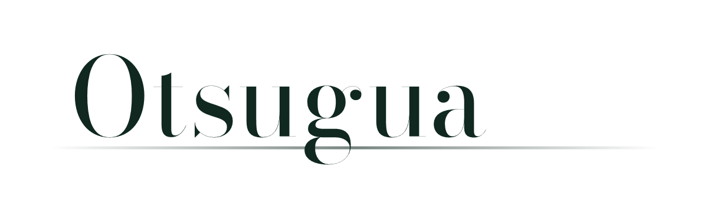

<p align="center">
  <picture>
    <source media="(prefers-color-scheme: dark)" srcset="docs/readme/otsugua-mark-dark.png">
    
  </picture>
</p>

<p align="center">
  
  
  
  
</p>

# Otsugua Portfolio

A portfolio application for Guilherme Augusto: a full-stack Laravel developer
who designs product surfaces around clear workflows, inspectable systems, and
coherent visual hierarchy.

The site is not a collection of decorative case studies. Its project slices are
built as credible interface surfaces that demonstrate product judgment,
interaction design, frontend craft, and implementation discipline.

## What it demonstrates

- A responsive, bilingual Laravel/Blade portfolio surface with light and dark themes.
- Product-oriented interface design rather than static marketing mockups.
- Visual QA with Playwright alongside Laravel feature and structural checks.
- Three fictional but plausible product slices that each express a different
  engineering/product capability.

## Project slices

| Slice | Focus |
| --- | --- |
| Harbor Ledger | TDD-oriented pricing, release control, and approval workflows. |
| Northline Learning Ops | DDD-oriented learning operations and operational clarity. |
| Studio Current | A design-for-impact client portal surface. |

## Local setup

Requirements:

- PHP 8.3+
- Composer
- Node/npm

```bash
composer install
npm install
cp .env.example .env
php artisan key:generate
npm run build
```

For local frontend development:

```bash
npm run dev
```

With Laravel Herd, open:

```text
http://twelveo-cc.test
```

## Verification

```bash
php artisan test --compact
npm run test:browser
npm run build
```

## License and use

Copyright (c) 2026 Guilherme Otsugua. All rights reserved.

This repository is provided for viewing and evaluation only. No license is
granted to copy, modify, distribute, sublicense, or use this code in another
project without prior written permission.
